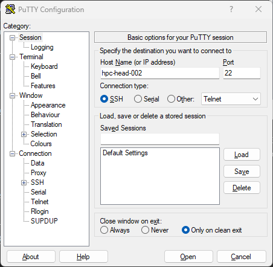
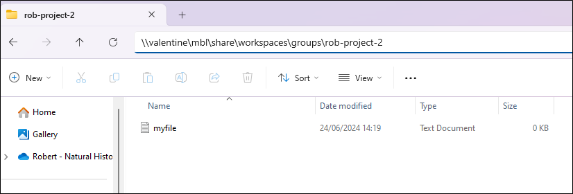
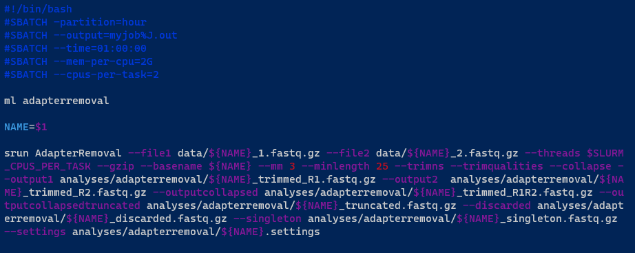

# NHM HPC
{: .no_toc }

## Table of contents
{: .no_toc .text-delta }

- TOC
{:toc}

---

## Overview

An HPC (High Performance Computing) cluster is a collection of interconnected computers (nodes) that work together to perform complex computational tasks. These clusters are designed to provide high processing power by combining the resources of multiple nodes to tackle large-scale problems more efficiently than a single computer could. HPC clusters are commonly used in scientific research, simulations, data analysis, and other fields that require significant computing capabilities.

NHM provides an HPC cluster accessible to staff. This guide details the primary components of the cluster and offers instructions on how to utilize it.

### Login node

The head node is the node you log into using SSH, and is used to manage files, install software, and submit jobs through the job scheduler (Slurm). The head node is called **hpc-head-002**.


### Compute nodes

The compute nodes are where the actual computations are performed. Jobs are distributed across these nodes to utilize their combined processing power. 

| Hostname     | CPUs | Memory | GPUs                       |               
|--------------|------|--------|----------------------------| 
| hpc-cpu-001  | 192  | 2TB    | n/a                        |
| hpc-cpu-005  | 64   | 64GB   | n/a                        |
| hpc-cpu-006  | 64   | 192GB  | n/a                        |
| hpc-cpu-007  | 192  | 2TB    | 2 X Nvidia A2 16GB         |
| hpc-gpu-001  | 192  | 2TB    | 1 x Nvidia Tesla V100 32GB |
| hpc-gpu-002  | 192  | 2TB    | 1 x Nvidia Tesla V100 32GB |


### Requesting access

Email [TS-ServiceDesk@nhm.ac.uk](mailto:TS-ServiceDesk@nhm.ac.uk) to request access to HPC.

### Technical support

Check out the [HPC Users Community](https://teams.microsoft.com/l/channel/19%3A8aa968ad33924f1e9ac3b4a78862eac4%40thread.tacv2/General?groupId=7e89a01f-f1c5-4886-b494-0ac470650c5a>) on Microsoft Teams for assistance from fellow users and cluster admins, as well as the latest news and updates about the cluster. 

You can also contact Technology Solutions via email at [TS-ServiceDesk@nhm.ac.uk](mailto:TS-ServiceDesk@nhm.ac.uk).

---

## Logging in

Once access is granted, you can log in using an SSH client such as:

- PuTTy (available on Windows) - click [here](#using-putty) for instructions
- Terminal (available on Linux, macOS, Windows) - click [here](#using-terminal) for instructions

Use your NHM username and password, which are the same credentials you use to log into your NHM computer, if you have one.

{: .note }
> If you are on an NHM computer (either at the museum or working remotely via VPN), log in directly to the head node hpc-head-002. If you are using a non-NHM computer, you need to connect through the bastion, which is known as **orca**. For detailed instructions on connecting through the orca, click [here](orca.html). 

### Using PuTTy

To log in using PuTTy, enter the hostname `hpc-head-002` and select **Open**. 



Enter your username and password at the prompt to log in, and you will be presented with the welcome message:
```
login as: robtest1234
Pre-authentication banner message from server:
| -----------------------------------------------------------
| ---  This is the Natural History Museum in London, UK.  ---
| ---  If you are not an authorised user GO NO FURTHER !  ---
| ---  If you have problems connecting, contact :         ---
| ---          ts-servicedesk@nhm.ac.uk                   ---
| -----------------------------------------------------------
End of banner message from server
robtest1234@hpc-head-002's password:
Last login: Thu Feb  6 21:36:12 2025 from 157.140.3.51

--------------------------------------
---   Welcome to the HPC cluster   ---
--------------------------------------

User guide:
https://naturalhistorymuseum.sharepoint.com/:w:/r/sites/HPCCAB/Sha...


Visit the HPC Users Community on Microsoft Teams:
https://teams.microsoft.com/l/channel/19%3a8aa968ad33924f1e9ac3b4a...

robtest1234@hpc-head-002:~$
```

### Using Terminal

To log in using a terminal, type `ssh <username>@hpc-head-002`. For example:
```
$ ssh robtest1234@hpc-head-002
-----------------------------------------------------------
---  This is the Natural History Museum in London, UK.  ---
---  If you are not an authorised user GO NO FURTHER !  ---
---  If you have problems connecting, contact :         ---
---          ts-servicedesk@nhm.ac.uk                   ---
-----------------------------------------------------------
robtest1234@hpc-head-002's password:
Welcome to Ubuntu 20.04.6 LTS (GNU/Linux 5.4.0-187-generic x86_64)

 * Documentation:  https://help.ubuntu.com
 * Management:     https://landscape.canonical.com
 * Support:        https://ubuntu.com/advantage

# ...

robtest1234@hpc-head-002:~$
```
---

## Transferring files

To upload and download data you can use various methods, such as scp, sftp, and rsync. Each method is described below. These instructions assume you are on VPN. If you are not, please see the [orca user guide](orca.md) for instructions on how to transfer files through orca.

- [scp](#scp)
- [sftp](#sftp)
- [rsync](#rsync)
- [smb](#smb)

The examples below show how to use these tools from the command line, but you can also use graphical tools, such as WinSCP, FileZilla and Cyberduck.

### scp

To **upload** files or directories from your computer to the cluster:

```
scp /path/to/source <username>@hpc-head-002:/path/to/destination
```

For example:

```
scp -r myfiles/ robtest1234@hpc-head-002:~/mystuff
robtest1234@hpc-head-002's password:
file2                                                            100%    5     0.3KB/s   00:00
file3                                                            100%    5     0.3KB/s   00:00
file1                                                            100%    5     0.3KB/s   00:00
```


To **download** from the cluster to your computer:
```
scp -r <username>@hpc-head-002:/path/to/source /path/to/destination
```

For example:
```
scp -r robtest1234@hpc-jobs-001:~/mystuff .
robtest1234@hpc-jobs-001's password:
file3                                                            100%    5     0.1KB/s   00:00
file2                                                            100%    5     0.1KB/s   00:00
file1                                                            100%    5     0.1KB/s   00:00
```    

### sftp

To **upload** files or directories from your computer to the cluster, use the `put` option. For example:

```
sftp robtest1234@hpc-head-002
robtest1234@hpc-head-002's password:
Connected to hpc-head-002.
sftp> put -r myfiles/
Uploading myfiles/ to /home/robtest1234/myfiles
Entering myfiles/
file2                                                            100%    5     0.3KB/s   00:00
file3                                                            100%    5     0.3KB/s   00:00
file1                                                            100%    5     0.2KB/s   00:00
sftp> exit
 ```   

To **download** files or directories from the cluster to your computer, use the `get` option. For example:
```
sftp robtest1234@hpc-head-002
robtest1234@hpc-head-002's password:
Connected to hpc-head-002.
sftp> get -r mystuff
Fetching /home/robtest1234/mystuff/ to mystuff
Retrieving /home/robtest1234/mystuff
file3                                                            100%    5     0.1KB/s   00:00
file2                                                            100%    5     0.1KB/s   00:00
file1                                                            100%    5     0.1KB/s   00:00
sftp> exit
```

### rsync

To **upload** files or directories from your computer to the cluster:
```
rsync -avP /path/to/source <username>@hpc-head-002:/path/to/destination
```

For example:
```
rsync -avP mystuff robtest1234@hpc-head-002:~/somedir
-----------------------------------------------------------
---  This is the Natural History Museum in London, UK.  ---
---  If you are not an authorised user GO NO FURTHER !  ---
---  If you have problems connecting, contact :         ---
---          ts-servicedesk@nhm.ac.uk                   ---
-----------------------------------------------------------
robtest1234@hpc-head-002's password:
sending incremental file list
mystuff/
mystuff/file1
            5 100%    0.00kB/s    0:00:00 (xfr#1, to-chk=2/4)
mystuff/file2
            5 100%    4.88kB/s    0:00:00 (xfr#2, to-chk=1/4)
mystuff/file3
            5 100%    4.88kB/s    0:00:00 (xfr#3, to-chk=0/4)

sent 281 bytes  received 77 bytes  79.56 bytes/sec
total size is 15  speedup is 0.04
```

To **download** files or directories from the cluster to your computer:
```
rsync -avP  <username>@hpc-head-002:/path/to/source /path/to/destination
```

For example:
```
rsync -avP robtest1234@hpc-head-002:~/somedir/mystuff .
-----------------------------------------------------------
---  This is the Natural History Museum in London, UK.  ---
---  If you are not an authorised user GO NO FURTHER !  ---
---  If you have problems connecting, contact :         ---
---          ts-servicedesk@nhm.ac.uk                   ---
-----------------------------------------------------------
robtest1234@hpc-head-002's password:
receiving incremental file list
mystuff/
mystuff/file1
            5 100%    4.88kB/s    0:00:00 (xfr#1, to-chk=2/4)
mystuff/file2
            5 100%    4.88kB/s    0:00:00 (xfr#2, to-chk=1/4)
mystuff/file3
            5 100%    4.88kB/s    0:00:00 (xfr#3, to-chk=0/4)

sent 85 bytes  received 309 bytes  87.56 bytes/sec
total size is 15  speedup is 0.04
```
  
### smb

You can transfer files via smb (also known as *samba* or *cifs*) using. **File Explorer** in Windows or **Finder** in macOS. 

To do this via File Explorer, browse to the location of the workspace, such as `\\valentine\mbl\share\workspaces\groups\<folder_name>`.



Or you can use the command line, as described below. You may need to install *smbclient* first. On Ubuntu Linux you can do this by running `sudo apt install smbclient`.

To **upload** a file, connect to Valentine:
```
smbclient -U <username>@nhm.ac.uk \\\\valentine\\<share_name>
```

Change to the directory you want to upload the file to:
```
cd <destination_folder>
```

Upload the file:
```
put <file_name>
```
Check that the file has been uploaded:
```
ls
```

Exit the prompt:
```
exit
```

For example:
```
$ smbclient -U robef3@nhm.ac.uk \\\\valentine\\mbl
Password for [robef3@nhm.ac.uk]:
Try "help" to get a list of possible commands.
smb: \> cd share\workspaces\groups\rob-project-2\
smb: \share\workspaces\groups\rob-project-2\> put myfile.txt
putting file myfile.txt as \share\workspaces\groups\rob-project-2\myfile.txt (0.0 kb/s) (average 0.0 kb/s)
smb: \share\workspaces\groups\rob-project-2\> ls
  .                                   D        0  Tue Apr 22 16:48:44 2025
  ..                                  D        0  Tue Apr 22 13:31:23 2025
  myfile.txt                          A        0  Tue Apr 22 16:48:44 2025

                245111980032 blocks of size 1024. 66813775872 blocks available
smb: \share\workspaces\groups\rob-project-2\> exit
```

To **download** a file, connect to Valentine:
```
smbclient -U <username>@nhm.ac.uk \\\\valentine\\<share_name>
```

Change to the directory you want to download the file from:
```
cd <origin_folder>
```
Download the file:
```
get <file_name>
```
Exit the prompt:
```
exit
```

For example:
```
$ smbclient -U robtest1234@nhm.ac.uk \\\\valentine\\mbl
Password for [robtest1234@nhm.ac.uk]:
Try "help" to get a list of possible commands.
smb: \> cd share\workspaces\groups\rob-project-2\
smb: \share\workspaces\groups\rob-project-2\> get myfile.txt
getting file \share\workspaces\groups\rob-project-2\myfile.txt of size 0 as myfile.txt (0.0 KiloBytes/sec) (average 0.0 KiloBytes/sec)
smb: \share\workspaces\groups\rob-project-2\> exit
```

---

## Data storage

- Home folders are found in `/home`
- Important project data should be stored in `/workspaces/groups`
- For temporary storage needed during job execution use `/mbl/share/scratch`
- Shared software for use by anyone can be stored in `/software`  

### Home folders

- **Path**: `/home/<username>`
- **Backed up**: once a day
- **Quota**: 50GB
- **Used for**:

  - Small files
  - Software only accessible to you (personal Conda environments, etc.)

When you log in, you'll be in your home directory, a personal area only you can access. Here, you can save small files and install software (Conda environments, etc.), but space is limited to 50GB. For larger files or long-term projects, use [group/project](#groupproject-folders) folders.

### Group/project folders

- **Paths**:<br>

  The groups folder can be accessed via any of these symlinks:

  - `/workspaces/groups`
  - `/mbl/share/workspaces/groups`   
  - `/gpfs/nhmfsa/bulk/share/data/mbl/share/workspaces/groups`

- **Backed up**: every 1-2 days
- **Quota**: 2TB
- **Used for**:

  - Projects
  - Collaboration with colleagues
  - Large files
  - Important data intended for long-term storage

It's best to store your important work here. If you need a new folder for your project, reach out to TS for assistance. Colleagues can also be given access, making these group workspaces ideal for collaborative efforts. Each folder has a default storage limit of 2TB, but can be increased if necessary.

### Shared software

- **Paths**:

  The shared software area can be accessed via any of these symlinks:

  - `/software`   
  - `/mbl/share/software`  
  - `/gpfs/nhmfsa/bulk/share/data/mbl/share/software`

- **Backed up**: every 1-2 days
- **Quota**: None
- **Used for**:

  - Software available to all users
  - Software you have compiled (usually with the `make` command) and want to make available for other users

### Scratch space

- **Path**: `/mbl/share/scratch`
- **Backed up**: never
- **Quota**: None
- **Used for**:

  - Temporary storage for files during job execution
  - Data that can be easily recreated

Scratch space serves as a temporary storage area for files needed only during job execution. The benefit of using this folder is that it won't affect your overall disk quota. Files in this folder are automatically deleted after 21 days of inactivity. However, it's recommended to delete them manually once you're finished.

{: .warning }
> Refrain from using the `/tmp` directory for temporary output, as it is reserved for system processes. Any data stored in `/tmp` may be deleted without notice.

---

## Installing software

You can install software in the following locations:

- Your home folder (using tools such as Conda).
- In a Singularity/Apptainer container image.
- The shared software area (by compiling the software).

Each method has pros and cons as described below.

| Location             | Pros                       | Cons                       |
|----------------------|----------------------------|----------------------------|
| Home folder          |<ul><li>Easy to do using tools like Conda</li><li>Only accessible by you, so anything you install won't affect other users</li></ul>|<ul><li>Space in your home folder is limited to 50GB|
| Singularity image    |<ul><li>An isolated environment where you can install all the dependencies you need</li><li>A consistent and reproducible software environment</li><li>Portable - you can transfer the image to your own computer or other HPC clusters</li><li>Shareable - other users can use the image as well (provided the image file is in a shared location, like a group workspace)|<ul><li>Learning curve to creating the image and running the container|
| Shared software area |<ul><li>No limits on space</li><li>Other users can also use the software|<ul><li>You must compile the software, so it's more complicated and takes longer</li><li>It can be difficult to do if the software requires a lot of dependencies|
         
### In your home folder

The easiest method of installing software is in your home folder. To do this you can use something like Conda, as described below.

#### Installing conda

You can download Conda from [here](https://docs.conda.io/en/latest/miniconda.html). Follow the instructions below to install it.

On hpc-head-002, change into your home folder:

```
cd ~
```

Download Miniconda installer:

```
wget https://repo.anaconda.com/miniconda/Miniconda3-latest-Linux-x86_64.sh
```

Make the file executable:

```
chmod +x Miniconda3-latest-Linux-x86_64.sh
```

Install Miniconda:

```
./Miniconda3-latest-Linux-x86_64.sh
```

For example:
```
robtest1234@hpc-head-002:~$ wget https://repo.anaconda.com/miniconda/Miniconda3-latest-Linux-x86_64.sh
--2025-04-22 08:25:48--  https://repo.anaconda.com/miniconda/Miniconda3-latest-Linux-x86_64.sh
Resolving repo.anaconda.com (repo.anaconda.com)... 104.16.32.241, 104.16.191.158, 2606:4700::6810:20f1, ...
Connecting to repo.anaconda.com (repo.anaconda.com)|104.16.32.241|:443... connected.
HTTP request sent, awaiting response... 200 OK
Length: 154615621 (147M) [application/octet-stream]
Saving to: ‘Miniconda3-latest-Linux-x86_64.sh’

Miniconda3-latest-Linux-x86_64.sh 100%[==========================================================>] 147.45M  43.8MB/s    in 3.4s

2025-04-22 08:26:04 (42.9 MB/s) - ‘Miniconda3-latest-Linux-x86_64.sh’ saved [154615621/154615621]

robtest1234@hpc-head-002:~$ chmod +x Miniconda3-latest-Linux-x86_64.sh
robtest1234@hpc-head-002:~$ ./Miniconda3-latest-Linux-x86_64.sh

Welcome to Miniconda3 py312_25.1.1-2

In order to continue the installation process, please review the license
agreement.
Please, press ENTER to continue
>>>
```

Answer yes to any questions, accept the default options, and wait for the installation to complete. Once done, reload your terminal:

```
. ~/.bashrc
```
You should see `(base)` in front of your prompt. This shows that Conda has been installed. For example:
```
(base) robtest1234@hpc-head-002:~$
```

#### Installing software with conda

You are now ready to use Conda to install any software you need. As an example, we will demonstrate how to use Conda to install an application called R.

This command will create a conda environment called `r-environment` and install two groups of packages called `r-essentials` and `r-base`:

```
conda create -n r-environment r-essentials r-base
```

For example:
```
(base) robtest1234@hpc-head-002:~$ conda create -n r-environment r-essentials r-base
Retrieving notices: done
Channels:
 - conda-forge
 - defaults
Platform: linux-64
Collecting package metadata (repodata.json): done
Solving environment: done
...
```


It may take a few minutes to install. Once done, activate the environment. You will see your prompt change from `(base)` to `(r-environment)`:

```
conda activate r-environment
```

For example:
```
(base) robtest1234@hpc-head-002:~$ conda activate r-environment
(r-environment) robtest1234@hpc-head-002:~$
```

You can use the `which` command to check that R is indeed installed in your home directory:

```
which R
```

For example:
```
(r-environment) robtest1234@hpc-head-002:~$ which R
/home/robtest1234/miniconda3/envs/r-environment/bin/R
```

Finally, launch R:

```
R
```

Example:
```
(r-environment) robtest1234@hpc-head-002:~$ R

R version 4.4.3 (2025-02-28) -- "Trophy Case"
Copyright (C) 2025 The R Foundation for Statistical Computing
Platform: x86_64-conda-linux-gnu

R is free software and comes with ABSOLUTELY NO WARRANTY.
You are welcome to redistribute it under certain conditions.
Type 'license()' or 'licence()' for distribution details.

R is a collaborative project with many contributors.
Type 'contributors()' for more information and
'citation()' on how to cite R or R packages in publications.

Type 'demo()' for some demos, 'help()' for on-line help, or
'help.start()' for an HTML browser interface to help.
Type 'q()' to quit R.

>
```

### Singularity/Apptainer

Singularity (sometimes called Apptainer) is a useful tool that allows you to install software inside an isolated environment known as a container. This allows you to install the software you need, without worrying about missing dependencies or conflicts with other software already installed on the cluster. You can learn more about it [here](https://apptainer.org/docs/user/latest). 

If you've worked with Docker, then this concept will be familiar to you. Singularity is commonly used on HPC systems instead of Docker, as Singularity can be run without admin rights. However, they are very similar to each other, and you can even convert Docker images to Singularity.

#### Creating a Singularity image 

You can create a Singularity image on your own computer, provided you have Singularity installed. Alternatively, you can use the software-building server **hpc-sw-003**, which already has it installed. Email [TS-ServiceDesk@nhm.ac.uk](mailto:TS-ServiceDesk@nhm.ac.uk) to request access to it. 

Using PuTTy or a terminal, SSH to hpc-sw-003:

```
ssh <username>@hpc-sw-003
```

Create your Singularity image file. You can name it anything, but it should end in `.def`:

```
touch <filename>.def
```

Open it with a text editor and construct your file. Here is a simple example:

```
Bootstrap: docker
From: ubuntu:24.04

%post
    apt update
    apt-get install bwa samtools -y

%help
    This is an Ubuntu container with bwa and samtools installed.
```

Here is an explanation of the different sections.

This section means use the `ubuntu:24.04` image from the Docker Hub container registry: 

```
Bootstrap: docker
From: ubuntu:24.04
```

{: .note }
> You can use other container registries and images, depending on your use case.

The `%post` section allows you to list commands to run when building the image. In this example we are installing the *bwa* and *samtools* applications inside the image:

```
%post
    apt update
    apt-get install bwa samtools -y
```

The `%help` section contains a helpful label that describes what the container does:

```
%help
    This is an Ubuntu container with bwa and samtools installed.
```

Now that you have your definition file, you can build the image. This will download the base image (Ubuntu in this example), install the software (bwa and samtools), and create an image file ending in `.sif`:

```
singularity build <filename>.sif <filename>.def
```

Example:
```
robtest1234@hpc-sw-003:~/bwa$ singularity build bwa.sif bwa.def
INFO:    User not listed in /etc/subuid, trying root-mapped namespace
INFO:    The %post section will be run under the fakeroot command
INFO:    Starting build...
Copying blob 2726e237d1a3 done   |
Copying config 602eb6fb31 done   |
Writing manifest to image destination
2025/04/22 11:10:26  info unpack layer: sha256:2726e237d1a374379e783053d93d0345c8a3bf3c57b5d35b099de1ad777486ee
INFO:    Running post scriptlet
+ apt update
Get:1 http://security.ubuntu.com/ubuntu noble-security InRelease [126 kB]
Get:2 http://archive.ubuntu.com/ubuntu noble InRelease [256 kB]

# ...

Processing triggers for ca-certificates (20240203) ...
Updating certificates in /etc/ssl/certs...
0 added, 0 removed; done.
Running hooks in /etc/ca-certificates/update.d...
done.
INFO:    Adding help info
INFO:    Creating SIF file...
INFO:    Build complete: bwa.sif

```

Now that you have an image file, you can run your container using the following command:

```
singularity run <filename>.sif
```
This is useful to see what you've created, as you can explore the file system and see what's installed. You can see from the `Apptainer>` prompt that you are inside the container. For example:
```
robtest1234@hpc-sw-003:~/bwa$ singularity run bwa.sif
Apptainer>
```

Now that you've built your image you can upload it to the HPC cluster using sftp or scp. For example:
```
robtest1234@hpc-sw-003:~/bwa$ sftp hpc-head-002
-----------------------------------------------------------
---  This is the Natural History Museum in London, UK.  ---
---  If you are not an authorised user GO NO FURTHER !  ---
---  If you have problems connecting, contact :         ---
---          ts-servicedesk@nhm.ac.uk                   ---
-----------------------------------------------------------
robtest1234@hpc-head-002's password:
Connected to hpc-head-002.
sftp> put bwa.sif
Uploading bwa.sif to /gpfs/nhmfsa/bulk/share/data/mbl/share/workspaces/users/robtest1234/bwa.sif
bwa.sif                                                                                   100%   76MB  16.6MB/s   00:04
sftp> exit
```

See [Example 3](#example-3---running-a-job-using-a-singularity-container) for guidance on how to write your Slurm script to run your Singularity container on the HPC cluster.

#### Converting a Docker image to Singularity 

Instead of creating a Singularity image from scratch, you can convert it from an existing Docker image. 

To do this, pull the image from the container registry (typically Docker Hub, but could be somewhere else):

```
singularity pull docker://<image>
```

Example: 
```
a-robef3@hpc-sw-003:~$ singularity pull docker://rockylinux/rockylinux
INFO:    Converting OCI blobs to SIF format
INFO:    Starting build...
Copying blob 71cc2ddb2ecf done   |
Copying config 523ffac7fb done   |
Writing manifest to image destination
2025/04/22 11:47:25  info unpack layer: sha256:71cc2ddb2ecf0e2a974aec10b55487120f03759e86e08b50a7f4c5d77638ab9b
INFO:    Creating SIF file...
```

This will create an image file ending in `.sif`. Then you can upload it to hcp-head-002 as described in the previous section.

### In the shared software area

If you install software in the shared software area, it means other users can also use it. There are two shared software locations, as described below.

| Location              | Description                                                                                                              |
|-----------------------|--------------------------------------------------------------------------------------------------------------------------|
| ``/software/testing`` | <ul><li>Anyone can install software here.<li>It is useful for testing and trying out new software installations.             |        
| ``/software/common``  | <ul><li>Only superusers can install software here.<li>It is intended for software that has been tested and is known to work. |

You can check which software has already been installed in the shared software area:

```
ml avail
```

For example:
```
robtest1234@hpc-head-002:~$ ml avail

------------------------------------------------- /software/common/lmod/lmod/modulefiles/Core --------------------------------------------------
   bcl2fastq/2.2.0             diamond/0.9.31  (D)    java/8.211              minimap2/2.16         python/3.7.bkp
   bedtools/2.29.0             emacs/26.2             jre/8.211               minimap2/2.17  (D)    python/3.7         (D)
   blast/2.4.0                 flash/latest           kallisto/0.44.0         ncbi_ngs/2.9.0        samtools/1.9
   blast/2.9.0          (D)    gffread/0.11.4         kallisto/0.45.0         ncbi_ngs/2.9.4 (D)    samtools/1.10      (D)
   bowtie/2.2.5                gmap/2019-09-12        kallisto/0.46.0  (D)    perl/5.28             settarg
   centrifuge/1.0.4beta        gnuplot/5.2.6          lmod                    plink/1.07            stringtie/2.0
   class2/2.1.7                hmmer/3.2.1            magicblast/1.4.0        prodigal/2.6.3        tophat/2.1.1
   diamond/0.9.24              htop/2.2.0             megan/6.15.2            python/2.7            transdecoder/5.5.0

------------------------------------------------------ /software/testing/modulefiles/Core ------------------------------------------------------
   BAMscorer/BAMscorer           bam2prof/bam2prof                ibs/ibs                                  pear/pear
   Eigensoft/Eigensoft           bam2vcf/bam2vcf                  idba/1.1.3                               platanus/2.02
   FastQC/fastqc                 bcftools/fastqc                  iqtree/1.6.12                            platanus/2.2.2          (D)
   GATK/gatk                     beagle/4.0                       kraken-biom/1.0.1                        plink/1.9               (D)
   JAGS/4.3.0.OLD                beagle5.1/beagle51               kraken2/2.0.8-b                          preseq/2.0
   JAGS/4.3.0             (D)    beast/2.6.3                      kraken2/2.1.2                     (D)    raxml/8.2.12
```

You can use the `ml spider` command for more detail:
```
robtest1234@hpc-head-002:~$ ml spider

--------------------------------------------------------------------------------------------------------------------------------------------
The following is a list of the modules currently available:
--------------------------------------------------------------------------------------------------------------------------------------------
  BAMscorer: BAMscorer/BAMscorer

  BSgenome: BSgenome/3.9
    Software infrastructure for efficient representation of full genomes and their SNPs.

  DESeq: DESeq/1.36.0
    DESeq library for differential expression analysis.

  Eigensoft: Eigensoft/Eigensoft

  FastQC: FastQC/fastqc

  GATK: GATK/gatk

  JAGS: JAGS/4.3.0.OLD, JAGS/4.3.0
```

To load a piece of software into your environment:
```
ml <software_name>/<version>
```

For example:
```
ml python/3.7
```

When you go to the folders `/software/testing` or `/software/common`, you may find more names, but if they do not appear when you run any of the commands above, they haven’t been properly installed. 

#### Example of installing shared software

Next, a real example: installing AdapterRemoval. You can follow this as a guideline to install any other software. Please use this as a rough guide, as the precise steps can vary depending on the software.

Move to the `/software/testing` folder:
```
cd /software/testing
```

Create the folder where you will keep the software:
```
mkdir -p adapterremoval/2.3.4/{src,x86_64/bin}
```

Move to the folder where you will download the software:
```
cd adapterremoval/2.3.4/src
```

Download the software (using the `-O` option, you can rename the downloaded file):
```
wget -O adapterremoval-2.3.4.tar.gz https://github.com/MikkelSchubert/adapterremoval/archive/v2.3.4.tar.gz
```

Decompress the files:
```
tar xvzf adapterremoval-2.3.4.tar.gz
```

Move to the folder where the software can be compiled:
```
cd adapterremoval-2.3.4
```

Compile the software:
```
make
```

Now you have a locally executable programme in `/software/testing/adapterremoval/2.3.4/src/adapterremoval-2.3.4/build/AdapterRemoval`. Copy the executable file to the bin folder you created at the beginning:
```
cp build/AdapterRemoval /software/testing/adapterremoval/2.3.4/x86_64/bin
```

Now it is necessary to create a module file which will allow you to load the software anytime you use it from any location. Create a folder to store the module file (make sure the folder name is the same as the one you created in `/software/testing`):
```
mkdir -p /software/testing/modulefiles/Core/adapterremoval
```

Then create the `.lua` file, which contains all the module information:
```
touch /software/testing/modulefiles/Core/adapterremoval/2.3.4.lua
```

This is the information that should be copied into the `.lua` file (using a text editor like vim or nano):
```
whatis("AdapterRemoval v2.3.4 - rapid adapter trimming, identification, and read merging http://adapterremoval.readthedocs.io/")
local name = "adapterremoval"
local version = "2.3.4"
local base = pathJoin("/software", "testing", name, version, "x86_64")
prepend_path("PATH", pathJoin(base, "bin"))
```

You can now see your new software is available for use by typing `ml --ignore-cache avail adapterremoval` (you can also see there is an older version 2.3.1 available, which is fine &ndash; it means users can use either version):
```
robtest1234@hpc-head-002:~$ ml --ignore-cache avail adapterremoval

------------------------------------------------ /software/testing/modulefiles/Core -------------------------------------------------
   adapterremoval/2.3.1    adapterremoval/2.3.2    adapterremoval/2.3.4 (D)

  Where:
   D:  Default Module

Use "module spider" to find all possible modules.
Use "module keyword key1 key2 ..." to search for all possible modules matching any of the "keys".
```


Now you're ready to use your new software, so you load it into your environment:
```
ml adapterremoval/2.3.4
```

You can check that it's loaded by typing `which AdapterRemoval`:
```
robtest1234@hpc-head-002:~$ which AdapterRemoval
/software/testing/adapterremoval/2.3.4/x86_64/bin/AdapterRemoval
```

Finally, you can run the software:
```
robtest1234@hpc-head-002:~$ AdapterRemoval
AdapterRemoval ver. 2.3.4

This program searches for and removes remnant adapter sequences from
your read data.  The program can analyze both single end and paired end
data.  For detailed explanation of the parameters, please refer to the
man page.  For comments, suggestions and feedback please use
https://github.com/MikkelSchubert/adapterremoval/issues/new
```

If at some point you want to install a newer version of the software, you don’t need to delete the old one (actually it can be useful to have both). You can install the new version in the same folder, for example:
```
mkdir -p /software/testing/adapterremoval/3.0.0/{src,x86_64/bin}
```

To load the old version:
```
ml adapterremoval/2.3.4
```

To load the new version:
```
ml adapterremoval/3.0.0
```

---

## Using the job scheduler (Slurm)

Now you have all the files and programs you need, but there's a problem: lots of people are running huge data analyses simultaneously. That's why job scheduling systems have been developed: to ensure a fair distribution of the computing resources across all users and to allow the cluster administrators to manage such resources. HPC uses a standard open-source job scheduling system called Slurm. A [complete user guide](https://slurm.schedmd.com/tutorials.html) can be found on their website and ideally you should become familiar with it. 

### Partitions/queues explained

The cluster has four main **partitions** (also known as **queues**) where you can submit your analyses (from here onwards sometimes defined as jobs) depending on their length and computational requirements: hour, day, week and month. As a general rule, the shorter the job and the less computationally expensive, the faster it gets assigned. Long analyses have lower priority.


| Partition | Use case                                                                                                           |
|-----------|--------------------------------------------------------------------------------------------------------------------|
| hour	    | Very short jobs, or things that can be sped up to less than an hour by multithreading                              |       
| day	    | Average jobs, or things that even with multithreading can take up to 24 hours                                      |
| week	    | Long jobs that take up to seven days, either because they cannot be parallelised or because they have low priority |
| month	    | Non-important jobs that can run for a long time and have low priority                                              |

Additionally, there is an **interactive** partition, that can be used to test computationally intensive tasks (almost any job really) to see how they perform, with a strict control of the used resources. There are many ways of using interactive, but it should not be abused as it can reduce the priority assigned to your future analyses. This is because the scheduling system calculates the priority of your jobs depending on how much you're using the cluster, and usually when you use an interactive session you're requesting a lot of resources (most of which you aren't even using).

### Submitting a job

- [Example 1](#example-1---running-a-job-using-software-installed-with-conda) - Running a job using software installed with conda
- [Example 2](#example-2---running-a-job-using-software-from-the-shared-software-area) - Running a job using software from the shared software area
- [Example 3](using-the-job-scheduler.md/#example-3---running-a-job-using-a-singularity-container) - Running a job using a Singularity container
- [Example 4](#example-4---running-a-job-using-the-gpu) - Running a job using the GPU

<br>

#### Example 1 - Running a job using software installed with conda

The first step is to create a file that contains all the instructions for the job scheduler to run the analysis. Here is an example file which I've named slurm_script.sh:

```
#!/bin/bash

#SBATCH -J rob-job
#SBATCH -p day
#SBATCH --mem=2GB
#SBATCH -c 2
#SBATCH -e /home/robtest1234/demo/test2/job.%J.err
#SBATCH -o /home/robtest1234/demo/test2/job.%J.out
#SBATCH -w hpc-gpu-002
#SBATCH --mail-user=robtest1234@nhm.ac.uk
#SBATCH --mail-type=ALL

source ~/miniconda3/etc/profile.d/conda.sh
conda init bash
conda activate base

echo "Starting at `date`"
echo "Running on hosts: $SLURM_NODELIST"
echo "Running on $SLURM_NNODES nodes"
echo "Current workig directory is `pwd`"

python python_script.py
```

The `#SBATCH` lines allow you to define various options for your job, as described below. Most of these options are not required, and there are many more that are not listed here, but they are important for optimization when the cluster gets busy and lots of people are submitting jobs to the same queue/partition:

```
-J             Job name
-p             Partition (queue)
--mem          Memory
-c             Number of CPUs
-e             Output file for standard error
-o             Output file for standard output
--mail-user    Who to send email notification for job state changes
--mail-type    Notify on state change: BEGIN, END, FAIL or ALL
```

Further options are described [here](https://slurm.schedmd.com/sbatch.html). 

These lines are required if you are using Conda from your home directory:
```
source ~/miniconda3/etc/profile.d/conda.sh
conda init bash
```

This line allows you to activate a Conda environment called `base`:
```
conda activate base
```

The `echo` commands are not required, but they demonstrate how you can add additional output for your job:
```
echo "Starting at `date`"
echo "Running on hosts: $SLURM_NODELIST"
echo "Running on $SLURM_NNODES nodes."
echo "Current working directory is `pwd`"
```
Finally, this is the actual command that you're running. In this example I'm using Python to run a script called `python_script.py`, which is located in the same directory as my `slurm_script.sh`:
```
python python_script.py
```

Use `sbatch` to submit your job:
```
sbatch <script_name>
```

For example:
```
robtest1234@hpc-head-002:~/demo/test2$ sbatch slurm_script.sh
Submitted batch job 965216
```

{: .note }
> If your analysis produces intermediate files between steps, you should set up a scratch folder for temporary files in `/mbl/share/scratch`. Ideally, clean up after your job. Scratch is set to auto-delete files after 21 days.

<br>

#### Example 2 - Running a job using software from the shared software area

Here is another sample job:



This time, instead of using Conda, it is using the `ml` command to load the `AdapterRemoval` software from the shared software area:
```
ml adapterremoval
```
Notice that instead of having a fixed sample name/ID, you can add a variable to your `.sh` file. The variable `NAME` allows you to make the shell script more flexible, as you do not have to modify it any time you have a different sample name/ID:
```
NAME=$1
```
Once the Slurm file is ready, you just need to submit the job:

```
sbatch slurm_script.sh SRR001
```

Or:
```
sbatch slurm_script.sh SRR002
```

If you have a text file listing all your sample names/IDs (in this case data/runids.txt), you can even use a `for` loop to submit several jobs simultaneously (there is also a way to do it internally in the script using an array job, but that is a more complex topic):
```
for i in $(cat data/runids.txt); do sbatch slurm_script.sh $i; done
```

If there are enough computational resources the jobs will run immediately (or at least some of them), otherwise they will be placed in a queue. 

<br>

#### Example 3 - Running a job using a Singularity container

Here is another sample job, this time using a Singularity container. Note the use of backslashes at the end of the lines, as the `singularity` command is split across multiple lines for readability:
```
#!/bin/bash

#SBATCH --partition=hour
#SBATCH -c 2
#SBATCH -e /home/robtest1234/demo/test3/job.%J.err
#SBATCH -o /home/robtest1234/demo/test3/job.%J.out

singularity run \
--bind /workspaces/groups/rob-project-2:/mnt \
/workspaces/groups/singularity-images/audiowaveform/1.7.0/audiowaveform.sif \
audiowaveform --version
```

This line means that we're going to run a Singularity container:
```
singularity run
```

By default, Singularity can only access data in your home folder. However, you can use the `--bind` option to mount additional folders inside the container, like this:
```
--bind /path/on/host:/path/in/container 
```

This would be useful if, for example, the job needed to read or write data in the `/workspaces/groups/rob-project-2` folder:

```
--bind /workspaces/groups/rob-project-2:/mnt
```
This line refers to the location of the singularity image:
```
/workspaces/groups/singularity-images/audiowaveform/1.7.0/audiowaveform.sif
```

This is the application or command that we want to execute inside the container:
```
audiowaveform --version
```

<br>

#### Example 4 - Running a job using the GPU

Here is a sample job that makes use of the GPU. Note that only one GPU job per node can run per at a time &ndash; if someone else's job is using the GPU, your job will wait in the queue until theirs is finished.

```
#!/bin/bash

#SBATCH -J rob-biomedisa
#SBATCH -p hour
#SBATCH --mem=2GB
#SBATCH -c 2
#SBATCH --gres=gpu
#SBATCH -e /home/robtest1234/demo/test4/job.%J.err
#SBATCH -o /home/robtest1234/demo/test4/job.%J.out
#SBATCH --mail-user=robtest1234@nhm.ac.uk
#SBATCH --mail-type=ALL

singularity run --nv \
/workspaces/groups/singularity-images/biomedisa/23.01.1/biomedisa.sif \
python3 /biomedisa/biomedisa_features/pycuda_test.py
```

This line is required to allow Slurm to access the GPU:
```
#SBATCH --gres=gpu
```

Like [Example 3](#example-3---running-a-job-using-a-singularity-container), this job runs in a Singularity container. The `--nv` option is necessary to allow Singularity to access the GPU.

### Viewing and managing your jobs

You can use `squeue` to view the status of jobs in the queue:
```
squeue -l
```

For example:
```
robtest1234@hpc-head-002:~$ squeue -l
Tue Apr 22 13:10:03 2025
             JOBID PARTITION     NAME     USER    STATE       TIME TIME_LIMI  NODES NODELIST(REASON)
            965037       day 11-ancIB   alexs4  RUNNING    1:31:05 1-00:00:00      1 hpc-gpu-002
            965226       day snakejob   danip3  RUNNING      29:19 1-00:00:00      1 hpc-cpu-001
            965227       day snakejob   danip3  RUNNING      29:07 1-00:00:00      1 hpc-cpu-001
            965230       day snakejob   danip3  RUNNING      27:05 1-00:00:00      1 hpc-cpu-001
            965274       day snakejob   danip3  RUNNING       0:02 1-00:00:00      1 hpc-cpu-001
            965275       day snakejob   danip3  RUNNING       0:02 1-00:00:00      1 hpc-cpu-001
          915974_4     month 2-aDNA_P   alexs4  RUNNING 7-07:54:29 30-00:00:00      1 hpc-cpu-001
            954429     month raxml_ng    beatl  RUNNING 8-16:32:45 30-00:00:00      1 hpc-cpu-001
          957954_4     month EAGenome   amelr1  RUNNING 7-19:08:15 30-00:00:00      1 hpc-gpu-002
            963590     month ALLSAMPL   amelr1  RUNNING 4-19:48:48 30-00:00:00      1 hpc-gpu-002
            963605     month ONLY3XCo   amelr1  RUNNING 4-19:46:39 30-00:00:00      1 hpc-gpu-002
            964163     month 3-parall   alexs4  RUNNING 3-04:31:30 30-00:00:00      1 hpc-cpu-006
            964249     month 4-parall   alexs4  RUNNING 2-07:02:27 30-00:00:00      1 hpc-cpu-006
            964294      week unicycle    larav  RUNNING 1-13:06:46 6-21:00:00      1 hpc-gpu-002
            964295      week unicycle    larav  RUNNING 1-13:03:04 6-21:00:00      1 hpc-gpu-002
            964296      week unicycle    larav  RUNNING 1-13:01:30 6-21:00:00      1 hpc-cpu-001
            964738      week mge_fast   danip3  RUNNING    3:14:39 7-00:00:00      1 hpc-cpu-006
            964739      week solver.s    zekuw  RUNNING    3:12:22 7-00:00:00      1 hpc-cpu-006
```

While your job is running, you can use `scontrol` to check its status:
```
scontrol show jobid <job_id>
```

For example:
```
robtest1234@hpc-head-002:~/demo/test4$ scontrol show jobid 965279
JobId=965279 JobName=rob-biomedisa
   UserId=robtest1234(1399642667) GroupId=domain users(1399600513) MCS_label=N/A
   Priority=4294715614 Nice=0 Account=core_research_labs QOS=normal
   JobState=COMPLETED Reason=None Dependency=(null)
   Requeue=1 Restarts=0 BatchFlag=1 Reboot=0 ExitCode=0:0
   RunTime=00:00:04 TimeLimit=01:00:00 TimeMin=N/A
   SubmitTime=2025-04-22T13:11:19 EligibleTime=2025-04-22T13:11:19
   AccrueTime=2025-04-22T13:11:19
   StartTime=2025-04-22T13:11:19 EndTime=2025-04-22T13:11:23 Deadline=N/A
   SuspendTime=None SecsPreSuspend=0 LastSchedEval=2025-04-22T13:11:19 Scheduler=Main
   Partition=hour AllocNode:Sid=hpc-head-002:1996908
   ReqNodeList=(null) ExcNodeList=(null)
   NodeList=hpc-gpu-002
   BatchHost=hpc-gpu-002
   NumNodes=1 NumCPUs=2 NumTasks=1 CPUs/Task=2 ReqB:S:C:T=0:0:*:*
   TRES=cpu=2,node=1,billing=2
   Socks/Node=* NtasksPerN:B:S:C=0:0:*:* CoreSpec=*
   MinCPUsNode=2 MinMemoryNode=2G MinTmpDiskNode=0
   Features=(null) DelayBoot=00:00:00
   OverSubscribe=OK Contiguous=0 Licenses=(null) Network=(null)
   Command=/gpfs/nhmfsa/bulk/share/data/mbl/share/workspaces/users/robtest1234/demo/test4/slurm_script.sh
   WorkDir=/gpfs/nhmfsa/bulk/share/data/mbl/share/workspaces/users/robtest1234/demo/test4
   StdErr=/home/robtest1234/demo/test4/job.%J.err
   StdIn=/dev/null
   StdOut=/home/robtest1234/demo/test4/job.%J.out
   Power=
   TresPerNode=gres:gpu
   MailUser=robtest1234@nhm.ac.uk MailType=INVALID_DEPEND,BEGIN,END,FAIL,REQUEUE,STAGE_OUT
```

Once your job is finished, you can use `sacct` to view details of your job. This is very useful information, because it will allow you to define the exact requirements of your jobs and make good use of the computational resources:
```
sacct --format=User,JobID,Jobname,partition,state,time,start,end,elapsed,MaxRss,MaxVMSize,nnodes,ncpus,nodelist -j <job_id>
```

For example:
```
robtest1234@hpc-head-002:~$ sacct --format=User,JobID,Jobname,partition,state,time,start,end,elapsed,MaxRss,MaxVMSize,nnodes,ncpus,nodelist -j 965279
     User JobID           JobName  Partition      State  Timelimit               Start                 End    Elapsed     MaxRSS  MaxVMSize   NNodes      NCPUS        NodeList
--------- ------------ ---------- ---------- ---------- ---------- ------------------- ------------------- ---------- ---------- ---------- -------- ---------- ---------------
robtest1+ 965279       rob-biome+       hour  COMPLETED   01:00:00 2025-04-22T13:11:19 2025-04-22T13:11:23   00:00:04                              1          2     hpc-gpu-002
          965279.batch      batch             COMPLETED            2025-04-22T13:11:19 2025-04-22T13:11:23   00:00:04      2484K    143144K        1          2     hpc-gpu-002
```

You can use `sinfo -l` to check that status of the cluster nodes. For example:
```
(base) robtest1234@hpc-head-002:~$ sinfo -l
Wed May 07 10:01:34 2025
PARTITION   AVAIL  TIMELIMIT   JOB_SIZE ROOT OVERSUBS     GROUPS  NODES       STATE NODELIST
month          up 30-00:00:0 1-infinite   no       NO        all      2       mixed hpc-cpu-001,hpc-gpu-002
month          up 30-00:00:0 1-infinite   no       NO        all      1   allocated hpc-cpu-006
week           up 7-00:00:00 1-infinite   no       NO        all      2       mixed hpc-cpu-001,hpc-gpu-002
week           up 7-00:00:00 1-infinite   no       NO        all      1   allocated hpc-cpu-006
day*           up 1-00:00:00 1-infinite   no       NO        all      2       mixed hpc-cpu-001,hpc-gpu-002
day*           up 1-00:00:00 1-infinite   no       NO        all      1   allocated hpc-cpu-006
hour           up    1:00:00 1-infinite   no       NO        all      2       mixed hpc-cpu-001,hpc-gpu-002
hour           up    1:00:00 1-infinite   no       NO        all      1   allocated hpc-cpu-006
sip            up 30-00:00:0 1-infinite   no       NO        all      2       mixed hpc-cpu-001,hpc-gpu-002
sip            up 30-00:00:0 1-infinite   no       NO        all      1   allocated hpc-cpu-006
sip            up 30-00:00:0 1-infinite   no       NO        all      1        idle hpc-cpu-005
gpu            up 30-00:00:0 1-infinite   no       NO        all      1    drained* hpc-gpu-001
galaxy         up 30-00:00:0 1-infinite   no       NO        all      2       mixed hpc-cpu-001,hpc-gpu-002
galaxy         up 30-00:00:0 1-infinite   no       NO        all      1   allocated hpc-cpu-006
interactive    up 1-00:00:00 1-infinite   no       NO        all      2       mixed hpc-cpu-001,hpc-gpu-002
interactive    up 1-00:00:00 1-infinite   no       NO        all      1   allocated hpc-cpu-006
ts             up 1-00:00:00 1-infinite   no       NO        all      1    drained* hpc-gpu-001
ts             up 1-00:00:00 1-infinite   no       NO        all      2       mixed hpc-cpu-001,hpc-gpu-002
ts             up 1-00:00:00 1-infinite   no       NO        all      1   allocated hpc-cpu-006
ts             up 1-00:00:00 1-infinite   no       NO        all      1        idle hpc-cpu-005
```

In the example above we can see the following:

- hpc-cpu-006 is in an **allocated** state, meaning it is fully utilized and cannot accept new jobs until the current ones are finished.
- hpc-cpu-001 and hpc-gpu-002 are in a **mixed** state, meaning they are running some jobs, but have free capacity to run more jobs.
- hpc-cpu-005 is in an **idle** state, meaning it is not currently running any jobs, and is ready to receive new jobs. 
- hpc-gpu-001 is in a **drained** state, meaning it is down for maintenance and cannot accept new jobs.

You can cancel your running job with `scancel <job_id>`. For example:
```
scancel 965310
```

Look at your own jobs in the queue with `squeue -u <username>`. For example: 
```
robtest1234@hpc-head-002:~/demo/test4$ squeue -u robtest1234
             JOBID PARTITION     NAME     USER ST       TIME  NODES NODELIST(REASON)
            965321      hour rob-biom robtest1 PD       0:00      1 (Resources)
            965322      hour rob-biom robtest1 PD       0:00      1 (Priority)
            965320      hour rob-biom robtest1  R       0:02      1 hpc-gpu-002
```

---

## Advanced topics

If you feel adventurous and want to learn more advanced topics related to the cluster, here are a few options:

- Slurm [cheat sheet](https://slurm.schedmd.com/pdfs/summary.pdf). 
- [Array jobs](https://slurm.schedmd.com/job_array.html) with Slurm. When doing loads of repetitive sequential analysis, this is a more efficient way of submitting jobs, instead of having individual ones.
- Learn more about environment modules with [Lmod](https://lmod.readthedocs.io/en/latest/#introduction-to-lmod).
- [Singularity/Apptainer](https://apptainer.org/documentation), a nice option to create containerized environments.
- [Conda](https://docs.conda.io/en/latest), a very popular open-source package management and environment management system.
- [Snakemake](https://snakemake.readthedocs.io/en/stable), Python-inspired workflow/pipeline management system to create reproducible and scalable data, creating contained environments that you can later deploy and execute in systems with different configurations. 
