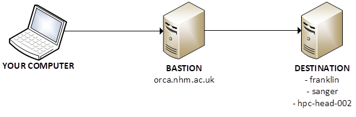
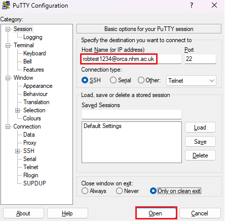
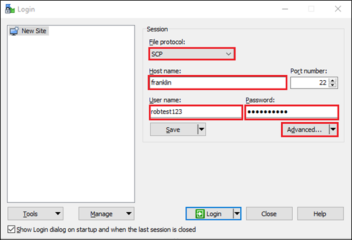
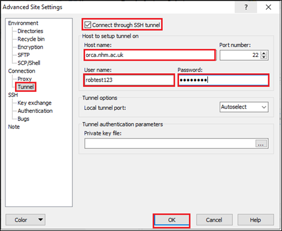
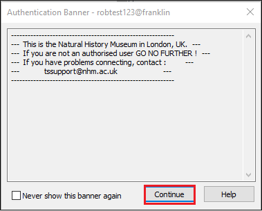
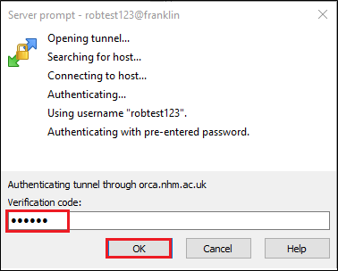
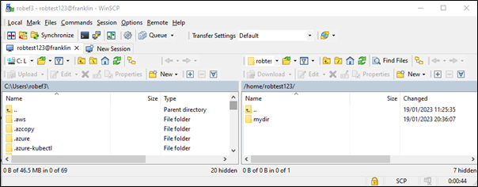
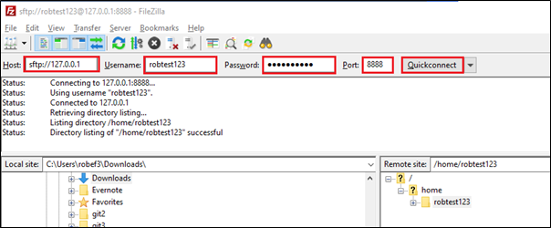

# Orca (Bastion)
{: .no_toc }

## Table of contents
{: .no_toc .text-delta }

- TOC
{:toc}

---

## What is Orca?
Most NHM servers are inaccessible from outside the NHM network unless you are connected to the VPN on an NHM laptop. Orca serves as a bastion server, providing a solution to this issue.

To connect to Orca, use an SSH client such as PuTTy or Terminal. Once connected, you can access servers within the NHM network, such as:

- franklin
- sanger
- hpc-head-002

<br>



Access to Orca must be granted by Technology Solutions. Email [TS-ServiceDesk@nhm.ac.uk](mailto:TS-ServiceDesk@nhm.ac.uk) to request access.

{: .note }
> If you’re using an NHM computer, you don't need to use Orca – use VPN instead.
 
---

## Usage guide

### Download Authenticator app

Orca employs multi-factor authentication (MFA), which can be facilitated using an authenticator app such as:

- Google Authenticator
- Microsoft Authenticator

You can download the app on your smartphone from the App Store (iOS) or the Play Store (Android). Both work phones and personal phones are suitable for this purpose.

### Connect to Orca for the first time

This section provides instructions on how to connect to Orca for the first time and set up your multi-factor authentication (MFA). This will be demonstrated using PuTTy (available on Windows) and the standard Terminal (available on Linux, macOS, and Windows). You can also use other SSH software if you prefer.

If using PuTTy, under **Host Name** type `<username>@orca.nhm.ac.uk`. Leave everything else as default and click **Open**. For example:



Or if using Terminal, type `ssh <username>@orca.nhm.ac.uk`. For example:

```
$ ssh robtest1234@orca.nhm.ac.uk
```

Type in your password at the prompt (you won't see it while typing, but it still works):

```
$ ssh robtest1234@orca.nhm.ac.uk
-----------------------------------------------------------
---  This is the Natural History Museum in London, UK.  ---
---  If you are not an authorised user GO NO FURTHER !  ---
---  If you have problems connecting, contact :         ---
---          ts-servicedesk@nhm.ac.uk                   ---
-----------------------------------------------------------
(robtest1234@orca.nhm.ac.uk) Password:
Last login: Thu May  8 16:56:52 2025 from 157.140.3.49
Please download the google authenticator to use with this verification code
Warning: pasting the following URL into your browser exposes the OTP secret to Google:
  https://www.google.com/chart?chs=200x200&chld=M|0&cht=qr&chl=otpauth://totp/robtest1
...
```

You will see a QR code. Scan it with the Authenticator app. At the `Enter code from app` prompt, enter the 6-digit code from the app. You should then see a prompt that says `<username>@ssh-bastion-6:~$`. This means that you're successfully connected to Orca.

{: .note }
> If the QR code does not display correctly or is too big for your screen, you will not be able to scan it. Don't worry - you will also see a **secret key**. You can type this into the Authenticator app instead of scanning the QR code. 

Now let's test that it's working. Close your PuTTy or Terminal window and re-open it, then connect again to `orca.nhm.ac.uk`. This time you will be prompted for your password and verification code from the Authenticator app. Enter these details and you will be successfully connected to Orca. For example:

```
$ ssh robtest1234@orca.nhm.ac.uk
-----------------------------------------------------------
---  This is the Natural History Museum in London, UK.  ---
---  If you are not an authorised user GO NO FURTHER !  ---
---  If you have problems connecting, contact :         ---
---          ts-servicedesk@nhm.ac.uk                   ---
-----------------------------------------------------------
(robtest1234@orca.nhm.ac.uk) Password:
(robtest1234@orca.nhm.ac.uk) Verification code:
Last login: Thu May  8 17:45:29 2025 from 157.140.3.49
verified
robtest1234@ssh-bastion-6:~$
```

### Connect to other servers via Orca

From Orca you can connect to other servers such as Franklin, Sanger, or hpc-head-002.

For example, to connect to hpc-head-002 you would type `ssh hpc-head-002` and enter your password. For example:

```
robtest1234@ssh-bastion-6:~$ ssh hpc-head-002
robtest1234@hpc-head-002's password:
Welcome to Ubuntu 20.04.6 LTS (GNU/Linux 5.4.0-200-generic x86_64)
...
robtest1234@hpc-head-002:~$
```

In the above example, I connected to Orca and then to hpc-head-002 in two separate steps. However, it's possible to do it in a single command, like this: 
```
ssh -J <username>@orca.nhm.ac.uk <username>@<destination_server>
```

For example, this is how I would connect from my computer to hpc-head-002 via Orca in a single command:

```
PS C:\Users\robef3> ssh -J robtest1234@orca.nhm.ac.uk robtest1234@hpc-head-002
-----------------------------------------------------------
---  This is the Natural History Museum in London, UK.  ---
---  If you are not an authorised user GO NO FURTHER !  ---
---  If you have problems connecting, contact :         ---
---          ts-servicedesk@nhm.ac.uk                   ---
-----------------------------------------------------------
(robtest1234@orca.nhm.ac.uk) Password:
(robtest1234@orca.nhm.ac.uk) Verification code:
robtest1234@hpc-head-002's password:
Welcome to Ubuntu 20.04.6 LTS (GNU/Linux 5.4.0-200-generic x86_64)
...
robtest1234@hpc-head-002:~$
```
 
### Using SCP

You can use SCP to transfer files through orca to your destination server. This can be done with a graphical program like [WinSCP](#winscp), or via the [Terminal](#terminal).

#### WinSCP

You can use WinSCP on a Windows machine to transfer files to and from a remote server. To do this, open WinSCP and fill in the details like below:

- File Protocol: **SCP**
- Host name: The server you want to connect to
- User name: Your username
- Password: Your password

Click **Advanced**.



Click **Tunnel**. Then tick the box **Connect through SSH tunnel**. Fill in the details like below:

- Host name: **orca.nhm.ac.uk**
- User name: Your username
- Password: Your password

Click **OK**, then **Login**.
 


Click **Continue** at the authentication banner.
 


Enter your verification code from the Authenticator app the click **OK**.

 

You may need to enter your password a second time, and may see a few prompts that you need to click through. You should then be connected to the remote server, where you can upload and download files.
 
 

#### Terminal

To use SCP to copy a file from your computer through orca to your destination server, use the following syntax:
```
scp -o 'ProxyJump <username>@orca.nhm.ac.uk' myfile <username>@<destination_server>:~/mydir
```

This example will upload a file called `myfile` from the local computer to the `/home/robtest1234/mydir` directory on hpc-head-002:

```
$ scp -o 'ProxyJump robtest1234@orca.nhm.ac.uk' myfile robtest1234@hpc-head-002:~/mydir
-----------------------------------------------------------
---  This is the Natural History Museum in London, UK.  ---
---  If you are not an authorised user GO NO FURTHER !  ---
---  If you have problems connecting, contact :         ---
---          ts-servicedesk@nhm.ac.uk                   ---
-----------------------------------------------------------
(robtest1234@orca.nhm.ac.uk) Password:
(robtest1234@orca.nhm.ac.uk) Verification code:
-----------------------------------------------------------
---  This is the Natural History Museum in London, UK.  ---
---  If you are not an authorised user GO NO FURTHER !  ---
---  If you have problems connecting, contact :         ---
---          ts-servicedesk@nhm.ac.uk                   ---
-----------------------------------------------------------
robtest1234@hpc-head-002's password:
myfile                        100%    0     0.0KB/s   00:00
(sphinx) [robef3@HYB-rF9MA5WUwGJ ~]$
```
 
### Using SFTP

#### FileZilla or Cyberduck

If you need to use a graphical SFTP client like FileZilla or Cyberduck, you will need to establish an SSH tunnel via the terminal. This is because FileZilla and Cyberduck do not have built-in tunnelling support (unlike WinSCP). 

On your computer, open the terminal and create the SSH tunnel. The `8888` in this command can be any unused port on your computer between 1024 and 32768:
```
ssh -L 8888:<destination_server>:22 <username>@orca.nhm.ac.uk cat -
```

Enter your password and Authenticator code. For example:
```
$ ssh -L 8888:hpc-head-002:22 robtest123@orca.nhm.ac.uk cat -
-----------------------------------------------------------
---  This is the Natural History Museum in London, UK.  ---
---  If you are not an authorised user GO NO FURTHER !  ---
---  If you have problems connecting, contact :         ---
---          ts-servicedesk@nhm.ac.uk                   ---
-----------------------------------------------------------
(robtest123@orca.nhm.ac.uk) Password:
(robtest123@orca.nhm.ac.uk) Verification code:

```

The terminal will appear to hang, but this is expected – it means the SSH tunnel has been established. 

{: .warning }
> Don't cancel out of it until you have finished your file transfer, otherwise the tunnel will be closed!

Open FileZilla and enter the following credentials (if using Cyberduck, the options are basically the same):

- Host: **sftp://127.0.0.1**
- Username: Your username 
- Password: Your password 
- Port: The same port used to establish the tunnel, i.e. 8888

Click **Quickconnect.**

If you see a prompt regarding Unknown Host Key, click **OK**.

You should then be connected to the remote server, where you can upload and download files.
 
 

Once you are done, go back to your terminal and close the SSH tunnel by pressing CTRL+C.

---

## Troubleshooting

### Unable to login?

If you are unable to login (password not working, Authenticator code not working, etc.) then email [TS-ServiceDesk@nhm.ac.uk](mailto:TS-ServiceDesk@nhm.ac.uk). 

Alternatively, post a message in the [HPC Users Community](https://teams.microsoft.com/l/channel/19%3A8aa968ad33924f1e9ac3b4a78862eac4%40thread.tacv2/General?groupId=7e89a01f-f1c5-4886-b494-0ac470650c5a>) Teams group and TS will assist.


