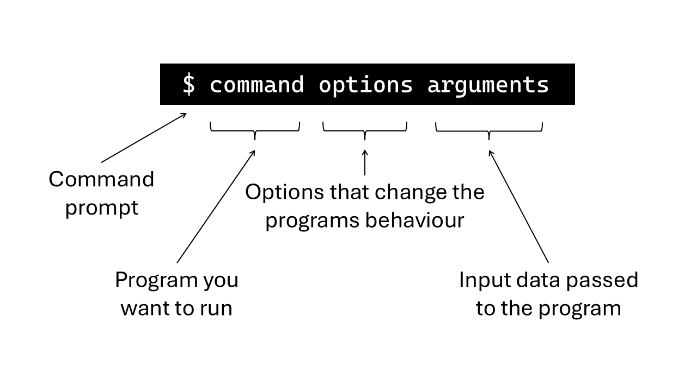

### What is Linux?
Linux is an open-source operating system, meaning it's free to use, modify, and share. It’s known for being fast, secure, and reliable, which makes it a popular choice for many bioinformaticians. 

Linux is especially useful for tasks that require high performance, such as handling large amounts of data or running complex analyses. It offers a powerful command-line interface, which allows users to automate tasks, work with scripts, and manage data more efficiently. Because it supports a wide range of software, developers and researchers can easily install and use tools for their work.

Overall, Linux is a great choice for anyone who needs a stable, flexible, and cost-effective operating system, especially for technical tasks and programming.

### Basic introduction to Linux

Now that you have Linux installed, you are ready to get started. 

With a Linux terminal, sometimes called a _command prompt_ or _console_, you interact with your computer using only text entered via the keyboard. 

The majority of tools used in bioinformatics are designed to only work on the command line so it is important to understand how it works. 

A linux terminal lets the user interact with an application called the _shell_, which translates text into command that the computer can understand. We will focus on the most commonly used shell _BASH_. 

There are hundreds of different commands in BASH, but don't worry, you only need a handful of commands to get started. Generally, commands follow the format below:



Code examples can be added like this: 
```
ls -ls
```

### Useful Linux commands
| Command | Use |
| ------- | --- |
| pwd     | Print working directory (i.e. the directory you are ‘in’) |
| cd <directory/name>   | change directory |
| cd ..   | Return to previous directory/move 'back' a directory |
| cd -    | Return to the last directory path you were in |
| cd ~    | Return to home directory (i.e. /home/[your_username] |
| [TAB]   | auto-complete |
| head  <filename>  | Show the ‘head’ (i.e. top) of a particular file |

- Also see [explainshell.com](https://explainshell.com/)

