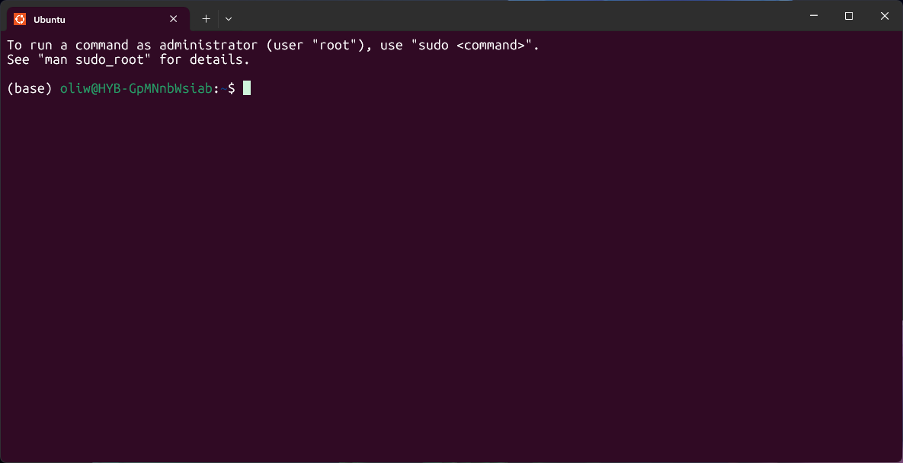

# NHM Linux training

This guide is intended to introduce researchers and students at the Natural History Museum to Linux so they can run their own analayses or work on the High Performatnce Computing facilities more effienctly.

### Contributors

A special thanks to researchers at the NHM who contributed to and maintain this training material: Andrea Waeschenbach, Maria Kamouyiaros, Daniel Parsons, Maria Magliulo, Jeff Streicher, Srishti Arya, Robert Foster and Oliver White.

### Contents

 - [What is Linux?](#what-is-linux)
 - [Linux Installation](#linux-installation)
   - [Windows](#windows)
   - [Mac](#mac)
 - [Basic introduction to Linux](#basic-introduction-to-linux)
 - [Installing tools](#installing-tools)
 - [Accessing High Performance Computing (HPC) facilities](#accessing-high-performance-computing-hpc-facilities)
 - [Using SLURM](#using-slurm)
 - [Dos and don'ts of working on an HPC](#dos-and-donts-of-working-on-an-hpc)
 - [Gettting help](#getting-help)

### Linux installation

#### Windows

To access a Linux terminal on Windows, we can use Windows Subsystem for Linux (WSL). It allows you to run a Linux distribution directly on your Windows machine.

Open PowerShell (search for "PowerShell" in the Start menu). _Note if you are on a museum laptop, you will need to open PowerShell as an Administrator_ (search for "PowerShell" in the Start menu, right-click, and select "Run as administrator").

Run the following command to enable WSL:

```
wsl --install
```

Once WSL is installed, restart your computer. 

To open a Linux terminal, open Powershell and run the following command:

```
wsl
```

It should look like this:


Windows also comes with an application called Terminal, which allows you to select an Ubuntu terminal.



#### Mac

Mac comes with a built-in terminal application that allows access to a Unix-based shell which is very similar to Linux. 

You can find it by clicking on the Spotlight search icon (top-right corner) and typing "Terminal". Alternatively, navigate to Applications > Utilities > Terminal.

### Basic introduction to Linux

Now you have a Linux installed, you are ready to get started. 

With a Linux terminal, sometimes called a _command prompt_ or _console_, you interact with you computer using only text entered via the keyboard. 

The majority of tools used in bioinformatics are designed to only work on the command line so it is important to understand how it works. 

A linux terminal lets the user interact with an application called the _shell_, which translates text into command that the computer can understand. We will focus on the most commonly used shell _BASH_. 

There are hundreds of different commands in BASH, but don't worry, you only need a handful of commands to get started. Generally, commands follow the format below:


Code examples can be added like this: 
```
ls -ls
```

### Installing tools

### Accessing High Performance Computing (HPC) facilities

Researchers at the NHM have access to two different HPC facilities: the *NHM HPC* and *Crop Diversity HPC*. Instructions for accessing both of these can be found below.

#### NHM HPC


#### Crop Diversity


Links to other papges can be added like this [Crop Diversity](https://help.cropdiversity.ac.uk/).

### Using SLURM

### Dos and don'ts of working on an HPC

### Gettting help